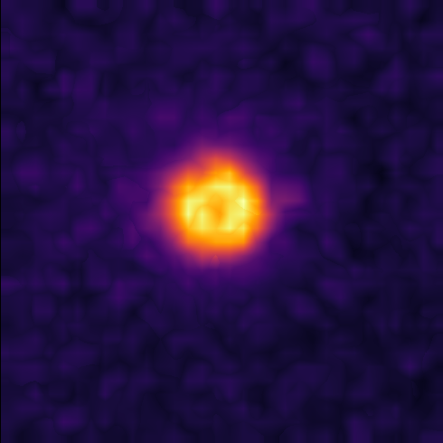

# napari-superres

napari-superres, a plugin for super-resolution microscopy

Open-source implementation of methods for Fluorescence Fluctuation based Super Resolution Microscopy (FF-SRM)

Review: [Alva, A. et al. Fluorescence fluctuation based super resolution microscopy, basic concepts for an easy start. bioRxiv 2022.05.06.490863 (2022) doi:10.1101/2022.05.06.490863](https://www.biorxiv.org/content/10.1101/2022.05.06.490863v1.full)

Implemented methods so far:
- SRRF
- MSSR
- ESI
 

| **Super Resolution Radial Fluctuations (SRRF)**  | **Mean-Shift Super Resolution (MSSR)** | **Entropy-based Super-resolution Imaging (ESI)** |
| --- | --- | --- |
|  |  |  |
from Fig. 7 of [Alva et al., 2022](https://www.biorxiv.org/content/10.1101/2022.05.06.490863v1.full) | from Fig. 2 of [García et al., 2021](https://www.biorxiv.org/content/10.1101/2021.10.17.464398v2.full)|  from Fig. 6 of [Alva et al., 2022](https://www.biorxiv.org/content/10.1101/2022.05.06.490863v1.full)|

References: 

[Alva, A. et al. Fluorescence fluctuation based super resolution microscopy, basic concepts for an easy start. bioRxiv 2022.05.06.490863 (2022) doi:10.1101/2022.05.06.490863](https://www.biorxiv.org/content/10.1101/2022.05.06.490863v1.full)

[García, E. T. et al. Nanoscopic resolution within a single imaging frame. bioRxiv 2021.10.17.464398 (2021) doi:10.1101/2021.10.17.464398](https://www.biorxiv.org/content/10.1101/2021.10.17.464398v2.full)

----------------------------------
Examples of use:

| **Original**  | **MSSR** |
| --- | --- |
|  |  |
| Parameters: | amplification: 2, PSF_p: 1, order: 1 |

| **Original**  | **SRRF** |
| --- | --- |
|  | |
| Parameters: | magnification: 2, spatial radius: 1, symmetry Axis: 1, f_start: 0, f_end: 3|

| **Original**  | **ESI** |
| --- | --- |
|  |  |
| Parameters: | nrResImage: 1, nrBins: 2, esi_order: 1 |

----------------------------------

This [napari] plugin was generated with [Cookiecutter] using [@napari]'s [cookiecutter-napari-plugin] template.

<!--
Don't miss the full getting started guide to set up your new package:
https://github.com/napari/cookiecutter-napari-plugin#getting-started

and review the napari docs for plugin developers:
https://napari.org/plugins/stable/index.html
-->

## Installation

You can install `napari-superres` via [pip]:

    pip install napari-superres

To install latest development version :

    pip install git+https://github.com/RoccoDAnt/napari-superres.git

## Contributing

Contributions are very welcome. Tests can be run with [tox], please ensure
the coverage at least stays the same before you submit a pull request.

## License

Distributed under the terms of the [BSD-3] license,
"napari-superres" is free and open source software

## Issues

If you encounter any problems, please [file an issue] along with a detailed description.

[napari]: https://github.com/napari/napari
[Cookiecutter]: https://github.com/audreyr/cookiecutter
[@napari]: https://github.com/napari
[MIT]: http://opensource.org/licenses/MIT
[BSD-3]: http://opensource.org/licenses/BSD-3-Clause
[GNU GPL v3.0]: http://www.gnu.org/licenses/gpl-3.0.txt
[GNU LGPL v3.0]: http://www.gnu.org/licenses/lgpl-3.0.txt
[Apache Software License 2.0]: http://www.apache.org/licenses/LICENSE-2.0
[Mozilla Public License 2.0]: https://www.mozilla.org/media/MPL/2.0/index.txt
[cookiecutter-napari-plugin]: https://github.com/napari/cookiecutter-napari-plugin

[file an issue]: https://github.com/RoccoDAnt/napari-superres/issues

[napari]: https://github.com/napari/napari
[tox]: https://tox.readthedocs.io/en/latest/
[pip]: https://pypi.org/project/pip/
[PyPI]: https://pypi.org/
