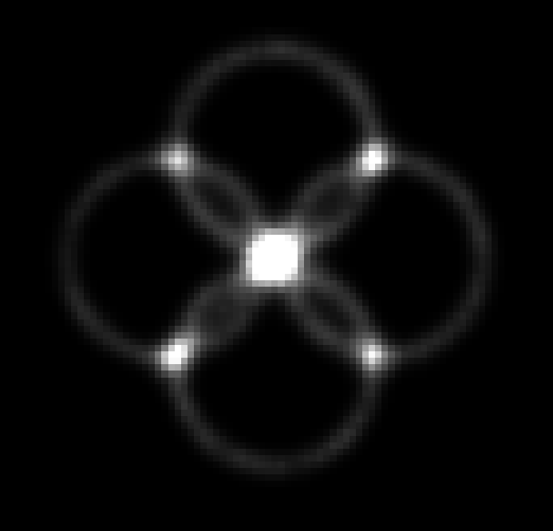
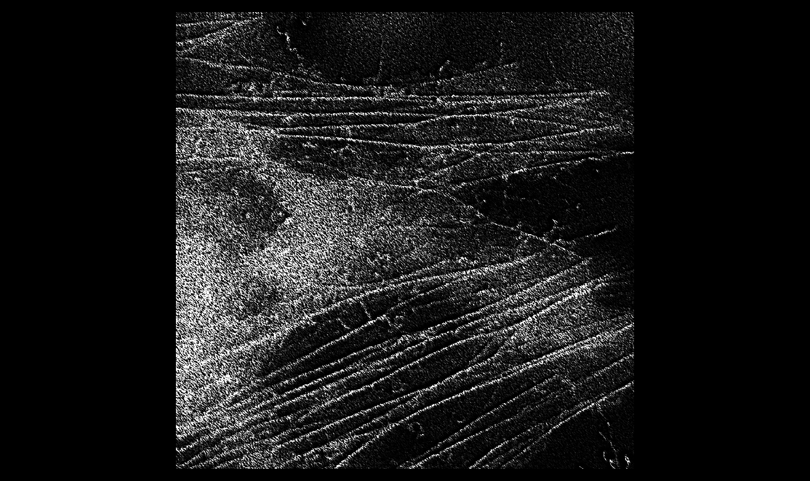
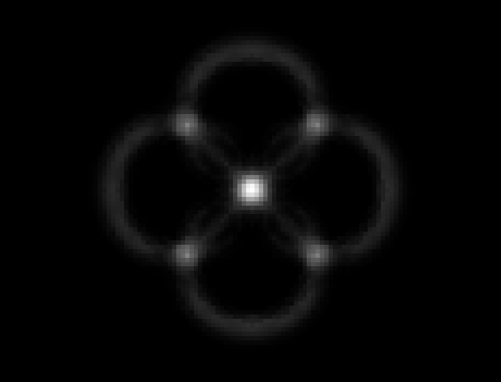

<!-- # napari-superres

napari-superres, a plugin for super-resolution microscopy

Open-source implementation of methods for Fluorescence Fluctuation based Super Resolution Microscopy (FF-SRM)

Review: [Alva et al., 2022. “Fluorescence Fluctuation-Based Super-Resolution Microscopy: Basic Concepts for an Easy Start.” Journal of Microscopy, August. https://doi.org/10.1111/jmi.13135](https://onlinelibrary.wiley.com/doi/10.1111/jmi.13135)

Implemented methods so far:
- SRRF
- MSSR
- ESI
 

| **Super Resolution Radial Fluctuations (SRRF)**  | **Mean-Shift Super Resolution (MSSR)** | **Entropy-based Super-resolution Imaging (ESI)** |
| --- | --- | --- |
|  |  |  |
from Fig. 7 of [Alva et al., 2022](https://onlinelibrary.wiley.com/doi/10.1111/jmi.13135) | from Fig. 2 of [García et al., 2021](https://www.biorxiv.org/content/10.1101/2021.10.17.464398v2.full)|  from Fig. 6 of [Alva et al., 2022](https://onlinelibrary.wiley.com/doi/10.1111/jmi.13135)|

References: 

[Alva et al. “Fluorescence Fluctuation-Based Super-Resolution Microscopy: Basic Concepts for an Easy Start.” Journal of Microscopy, August (2022). https://doi.org/10.1111/jmi.13135](https://onlinelibrary.wiley.com/doi/10.1111/jmi.13135)

[García, E. T. et al. Nanoscopic resolution within a single imaging frame. bioRxiv 2021.10.17.464398 (2021) doi:10.1101/2021.10.17.464398](https://www.biorxiv.org/content/10.1101/2021.10.17.464398v2.full)

----------------------------------
Examples of use:

| **Original**  | **MSSR** |
| --- | --- |
|  |  |
| Parameters: | amplification: 2, PSF_p: 1, order: 1 |

| **Original**  | **SRRF** |
| --- | --- |
|  | |
| Parameters: | magnification: 2, spatial radius: 1, symmetry Axis: 1, f_start: 0, f_end: 3|

| **Original**  | **ESI** |
| --- | --- |
|  |  |
| Parameters: | nrResImage: 1, nrBins: 2, esi_order: 1 |

----------------------------------

This [napari] plugin was generated with [Cookiecutter] using [@napari]'s [cookiecutter-napari-plugin] template.

<!--
Don't miss the full getting started guide to set up your new package:
https://github.com/napari/cookiecutter-napari-plugin#getting-started

and review the napari docs for plugin developers:
https://napari.org/plugins/stable/index.html

## Installation
Create a Conda environment and install napari:

    conda create -y -n napari-sr -c conda-forge python=3.8
    conda activate napari-sr
    pip install "napari[all]“

Work in progress - Tested on napari 0.4.13:

    pip install napari==0.4.13
    pip install imageio_ffmpeg
    pip install matplotlib
    conda install git
    pip install git+https://github.com/RoccoDAnt/napari-superres.git@b6a19dfa3c52617efca1fed2258231a0279a29b9

## Contributing

Contributions are very welcome. Tests can be run with [tox], please ensure
the coverage at least stays the same before you submit a pull request.

## License

Distributed under the terms of the [BSD-3] license,
"napari-superres" is free and open source software

## Issues

If you encounter any problems, please [file an issue] along with a detailed description.

[napari]: https://github.com/napari/napari
[Cookiecutter]: https://github.com/audreyr/cookiecutter
[@napari]: https://github.com/napari
[MIT]: http://opensource.org/licenses/MIT
[BSD-3]: http://opensource.org/licenses/BSD-3-Clause
[GNU GPL v3.0]: http://www.gnu.org/licenses/gpl-3.0.txt
[GNU LGPL v3.0]: http://www.gnu.org/licenses/lgpl-3.0.txt
[Apache Software License 2.0]: http://www.apache.org/licenses/LICENSE-2.0
[Mozilla Public License 2.0]: https://www.mozilla.org/media/MPL/2.0/index.txt
[cookiecutter-napari-plugin]: https://github.com/napari/cookiecutter-napari-plugin

[file an issue]: https://github.com/RoccoDAnt/napari-superres/issues

[napari]: https://github.com/napari/napari
[tox]: https://tox.readthedocs.io/en/latest/
[pip]: https://pypi.org/project/pip/
[PyPI]: https://pypi.org/ -->

# napari-superres

A collection of super-resolution microscopy FF-SRM methods.

Open-source implementation of methods for Fluorescence Fluctuation based Super Resolution Microscopy (FF-SRM):

Review: [Alva et al., 2022. “Fluorescence Fluctuation-Based Super-Resolution Microscopy: Basic Concepts for an Easy Start.” Journal of Microscopy, August.](https://onlinelibrary.wiley.com/doi/10.1111/jmi.13135)

MSSR article: [Torres-García, E., Pinto-Cámara, R., Linares, A. et al. Extending resolution within a single imaging frame. Nat Commun 13, 7452 (2022).](https://doi.org/10.1038/s41467-022-34693-9)

ESI article: [Idir Yahiatene, Simon Hennig, Marcel Müller, Thomas Huser (2015/2016). "Entropy-based Super-resolution Imaging (ESI): From Disorder to Fine Detail" ACS Photonics 8, 2 (2015)](https://doi.org/10.1021/acsphotonics.5b00307)

SOFI article: [T. Dertinger, R. Colyer, G. Iyer, and J. Enderlein. Fast, background-free, 3D super-resolution optical fluctuation imaging (SOFI). PNAS 52, 106 (2009) ](https://doi.org/10.1073/pnas.0907866106)

SRRF article: [Salsman, J.,  and, Dellaire, G., Super-Resolution Radial Fluctuations (SRRF) Microscopy, Methods in Molecular Biology 2440 (2022)](https://link.springer.com/protocol/10.1007/978-1-0716-2051-9_14)

MUSICAL article: [K. Agarwal and R. Machan, Multiple Signal Classification Algorithm for super-resolution fluorescence microscopy, Nature Communications, vol. 7, article id. 13752, (2016)](https://www.nature.com/articles/ncomms13752)

Methods implemented:
- MSSR
- ESI
- SOFI
- SRRF
- MUSICAL
- Split channels

| **Super Resolution Radial Fluctuations (SRRF)**  | **Mean-Shift Super Resolution (MSSR)** | **Entropy-based Super-resolution Imaging (ESI)** |
| --- | --- | --- |
|  |  |  |
from Fig. 7 of [Alva et al., 2022](https://onlinelibrary.wiley.com/doi/10.1111/jmi.13135) | from Fig. 2 of [García et al., 2021](https://www.biorxiv.org/content/10.1101/2021.10.17.464398v2.full)|  from Fig. 6 of [Alva et al., 2022](https://onlinelibrary.wiley.com/doi/10.1111/jmi.13135)|

Repositories available:
- [ESI](https://github.com/biophotonics-bielefeld/ESI) GitHub repository
- [PySOFI](https://github.com/xiyuyi-at-LLNL/pysofi) GitHub repository
- [MUSICAL](https://sites.google.com/site/uthkrishth/musical) Google site

----------------------------------

This [napari] plugin was generated with [Cookiecutter] using [@napari]'s [cookiecutter-napari-plugin] template.

<!--
Don't miss the full getting started guide to set up your new package:
https://github.com/napari/cookiecutter-napari-plugin#getting-started

and review the napari docs for plugin developers:
https://napari.org/stable/plugins/index.html
-->

## Installation
First install napari viewer:

    conda create -y -n napari-env -c conda-forge python=3.9
    conda activate napari-env
    pip install "napari[all]"

For details check: https://napari.org/stable/

<!-- Then, you can install `lnma-superres` napari plugins via [pip]:

    pip install lnma-superres -->

To install latest development version :

    pip install git+https://github.com/RoccoDAnt/napari-superres.git

You might need to install [git](https://git-scm.com/book/en/v2/Getting-Started-Installing-Git) first.

----------------------------------
Examples of use:

| **Original**  | **tMSSR** |
| --- | --- |
| 
  
| 
  
|
| Parameters: | Amplification: 2, Order: 0, PSF FWHM: 6,   Interpolation: Bicubic, Statistical integration: CV*sigma |

| **Original**  | **ESI** |
| --- | --- |
| 
  
 | 
  
 |
| Parameters: | image in output: 2, bins: 2, Order: 2 |

| **Original**  | **SOFI** |
| --- | --- |
|
  
 | 
  
 |
| Parameters: | Amplification factor: 2, Moment Order: 4, lambda parameter: 1.5, No. Iterations: 20, Window size: 100|

| **Original**  | **SRRF** |
| --- | --- |
|
  
 | 
  
|
| Parameters: | Amplification: 2, Spatial radius: 5, Symmetry Axis: 6, Start frame: 0, End frame: 48|

| **Original**  | **MUSICAL** |
| --- | --- |
| 
  
 | 
  
|
| Parameters: | Emission [nm]: 510 NA: 1.4, Mag: 100, Pizel size: 8000, Threshold: -0.5, Alpha: 4, Subpixels per pixel: 20|
----------------------------------

## Contributing

Contributions are very welcome. Tests can be run with [tox], please ensure
the coverage at least stays the same before you submit a pull request.

## License

Distributed under the terms of the [BSD-3] license,
"lnma-superres" is free and open source software

## Issues

If you encounter any problems, please [file an issue] along with a detailed description.

[napari]: https://github.com/napari/napari
[Cookiecutter]: https://github.com/audreyr/cookiecutter
[@napari]: https://github.com/napari
[MIT]: http://opensource.org/licenses/MIT
[BSD-3]: http://opensource.org/licenses/BSD-3-Clause
[GNU GPL v3.0]: http://www.gnu.org/licenses/gpl-3.0.txt
[GNU LGPL v3.0]: http://www.gnu.org/licenses/lgpl-3.0.txt
[Apache Software License 2.0]: http://www.apache.org/licenses/LICENSE-2.0
[Mozilla Public License 2.0]: https://www.mozilla.org/media/MPL/2.0/index.txt
[cookiecutter-napari-plugin]: https://github.com/napari/cookiecutter-napari-plugin

[file an issue]: https://github.com/Dr2-JMM/lnma-superres/issues

[napari]: https://github.com/napari/napari
[tox]: https://tox.readthedocs.io/en/latest/
[pip]: https://pypi.org/project/pip/
[PyPI]: https://pypi.org/
